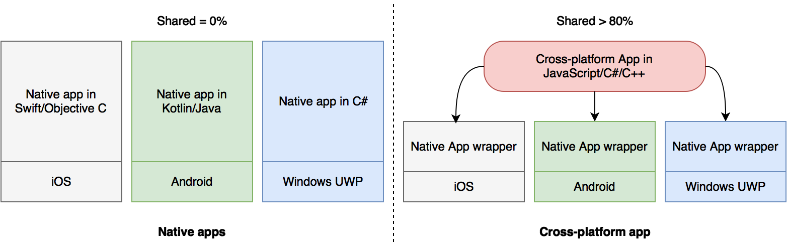
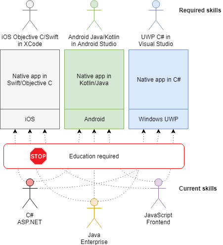

# 1. Native and cross-platform development tools

Historically, the computers market has always been competitive and every manufacturer has provided an optimal set of so-called "native" tools to develop applications for its operating systems and devices. Native development tools provide maximum performance and access to operating system capabilities.

Often, however, it was determined that these instruments were incompatible with each other, not only at the level of development language, patterns and architectures, but also at the level of the operating system or libraries. As a result, it was necessary to write an application for multiple environments in different programming languages to implement the same algorithms or business scenarios. For example, if you want to maintain 2 platforms, it requires twice as much work and team staff. Plus twice as much budget for support and development. Additionally, many companies already have a large code base, which also would be inherent in new solutions.

The second important point is the availability of the necessary competencies \(knowledge and experience\) within the team. If not, then it will take time to train.

Cross-platform development frameworks were created to solve both problems:

* maximize shared code base on a single programming language to make it easier to develop and maintain;

* use of existing competence and expertise to implementing applications on new platforms.

There are a lot of programming languages on the market \(and developers how use these languages\), which is why there are also a lot of tools for cross-platform development. In this book, we are only interested in tools for creating mobile business-applications, so in the following chapters we take a closer look at how they work. In the meantime, a little more details about each of the advantages of cross-platform development:

**Shared code base.** Depending on the selected tool, the developer can share this data between platforms: application resources \(images, fonts and other files\), data manipulation logic, business logic, and a user interface creation. It's simple to use shared resources and logic \(data processing and business\) but not so easy to work with UI, because each platform has its own recommendations and requirements.

**Use of existing competencies and team.** It is worth to take into account not only the programming language, but also an understanding of operating systems iOS/Android/Windows, as well as a set of additional libraries and development tools.

So, the native tools are provided by the owners of ecosystems and allow to get the maximum of the capabilities of the target operating system, have full access to native APIs, optimal performance and require a separate development team for every platform.

Cross-platform frameworks allow to reduce labor costs and speed up application release in case you need to support multiple platforms simultaneously, and have necessary competencies. In the long term, cross-platform solutions help save a decent amount of man-hours, but you should consider the features and limitations of the selected tool.