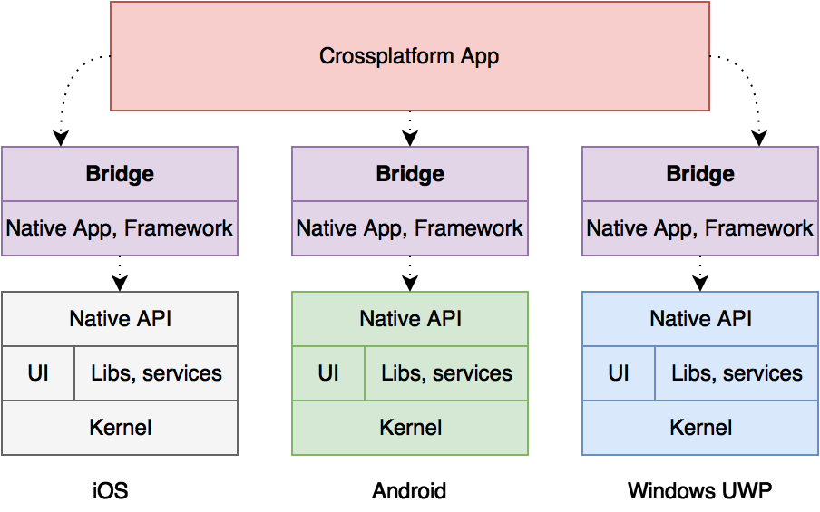
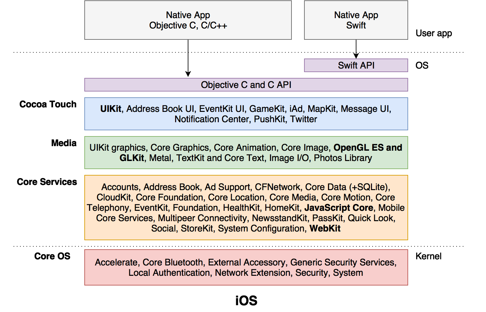
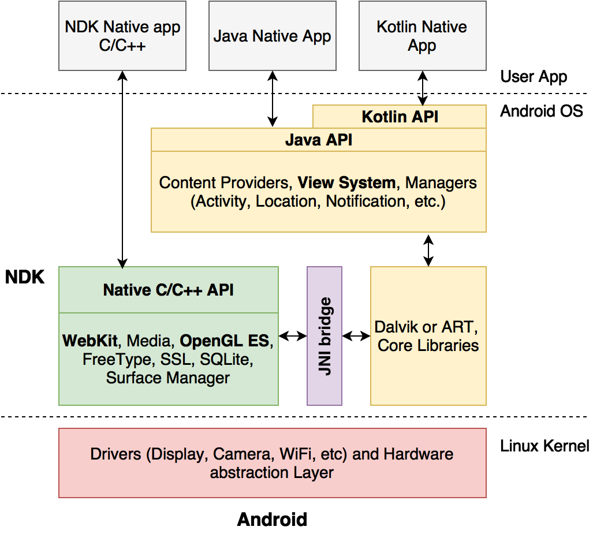
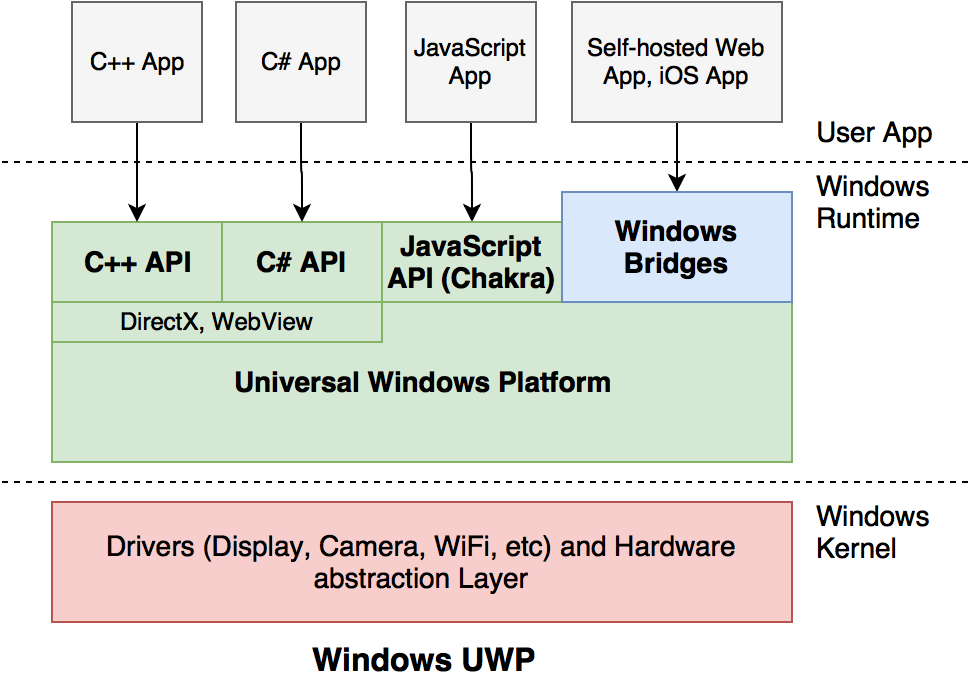

# 2. iOS/Android/Windows UWP architectures and native APIs

The main principle underlying in cross-platform solutions - separation of code into 2 parts:

* **cross-platform**, living in a virtual environment and having limited access to the capabilities of the target platform through a dedicated bridge;

* **native**, which initializes the application life-cycle management of key facilities and having full access to the API system.

In order to bridge the gap between the world of “native” and the world “cross platform”, you must use a special **bridge**. And as we will see in Chapter 3, it's the bridge that defines the capabilities and limitations of cross-platform frameworks.

---

**NOTE: Using bridge always has a negative impact on performance by transforming data between worlds, as well as converting API calls and libraries. By itself, the “cross-platform” world is comparable with native performance**

---

So, all cross-platform applications must have a native part, otherwise the operating system simply will not be able to run them. So let's take a closer look at what API systems and mechanisms are provided by the iOS, Android and Windows.

### 2.1 Native iOS

We'll start our review of the iOS operating system, which is based on Mac OS X, created from the NeXTSTEP OS, a full-fledged Unix-system. Therefore, iOS should be considered as a full-fledged Unix system without the command line. Low level native interfaces in iOS are implemented by analogy with the Unix and C language.

For an native iOS developer, the choice of languages is limited to Objective C and Swift, because native tools and APIs are implemented for them. You can also use the C/C++, but it will be either from the urgent need \(there is an existing code base\) or from a strong curiosity, because you need high qualification and writing decent code-base. The high level architecture of iOS is shown below.

Additionally, in the diagram, we noted the subsystems that are important for cross-platform frameworks:

* **WebKit** is used in hybrid applications based on PhoneGap or similar to run applications and actually performs the runtime environment of web applications;

* **JavaScript Core** is used in ReactNative and similar for the rapid implementation of the JS-code and data exchange between Native and JS;

* **OpenGL ES** is used in games and applications on Qt/QML or similar to render the interface;

* **UIKit** is responsible for native user interface of the application, which is important for ReactNative and Xamarin.

As you can see, out of the box, iOS provides ready interfaces for Objective C \(Swift works as an add-in\), plus there are mechanisms for cross-platform HTML/JS-based applications \(WebKit, JavaScriptCore\). With the iOS system, a call-level API can work with any frameworks that support Unix-calls, but to fully interact with the Objective C API from other languages will need to write special wrappers.

---

**NOTE: Just in Time compilation is not available in iOS except for the compilation of JavaScript using WebKit. This is due to the fact that iOS has no access to the writable executable memory, which does not allow to generate executable code dynamically.**

---

Due to the limitations of iOS, all apps require JIT \(except JavaScript\) need to be compiled to a native code \(Ahead Of Time compilation, AOT\), which could be a surprise to Java and .NET developers. This limitation is dictated by increased security and performance requirements.

### 2.2 Native Android

Android is also a Unix-based system, and mostly based on Linux, with all its pros and cons. However, Android is not totally based on Linux, because on top of the core, OS created its own infrastructure, including a Java Virtual machine \(Java Virtual machine, JVM\) to run applications. The JVM acts as an intermediary between the user code and a set of API systems available for Java applications. Kotlin language support is built on the infrastructure which is available to Java.

As you can see, there are 2 sets of APIs available for Android developers: Native Development Kit \(Android NDK\) and Android SDK.

Using the NDK you can get an access to low level APIs of Android. The development is in C/C++. 

When using the Android SDK, a developer is inside the Java machine Dalvik \(or Android Runtime, ART\) and have only the features that Java API provides.

The link between low-level libraries \(C/C++\) and Java infrastructure is the special JNI Bridge \(Java Native Interface\), which allows two worlds to interact with each other. JNI acts as a single and universal connection, however, as any bridge, leads to a decline in performance if used inefficiently.

---

**NOTE: JNI reduces application performance when a large flow of commands and data are transmitted through the bridge**

---

In addition to the JNI bridge in the architecture of Android also should pay attention to the existence of the WebKit subsystems \(PhoneGap\), OpenGL ES \(for Qt and games\) and View System \(iOS UIKit; for ReactNative and Xamarin\) similar modules in iOS. However, compared to iOS, it has less restrictions - JIT can be used not only for JavaScript, but also other languages, plus there is no tight binding to JS-engine. 

Android itself, until recently, used JIT for Java applications, which did not have the best impact on performance. Starting with version 5.0, Android added the mechanism of AOT-compile bytecode \(as part of ART\) that has improved the behavior of programs, but did not remove restrictions of JNI bridge. Looking ahead, we note that JNI is used in applications with Xamarin and Qt.

### 2.3 Native Windows UWP

Finally, let's look at the Windows UWP architecture, which is the most omnivorous and provides a large number of different interfaces and interaction mechanisms, including Windows Bridges \([https://developer.microsoft.com/en-us/windows/bridges](https://developer.microsoft.com/en-us/windows/bridges)\)

In addition to the traditional API for C++/C\#, Windows UWP also provides mechanisms operate on the basis of the JavaScript engine Chakra, which is used in Edge. Microsoft supports open source version ReactNative on Windows UWP: [https://github.com/Microsoft/react-native-windows](https://github.com/Microsoft/react-native-windows)

The system also has a **WebView** and is suitable for PhoneGap applications. There is **no OpenGL ES** implementation, only DirectX is available instead.

As “strange” solutions in Windows are also available in a variety of technologies bridging, for example, to run self-hosted sites \([https://developer.microsoft.com/en-us/windows/bridges/hosted-web-apps](https://developer.microsoft.com/en-us/windows/bridges/hosted-web-apps)\) as local apps and classic Win32 desktop programs or iOS apps \([https://developer.microsoft.com/en-us/windows/bridges/ios](https://developer.microsoft.com/en-us/windows/bridges/ios)\).

It is important for us that Windows UWP provides all the necessary mechanisms for PhoneGap, and Qt ReactNative. If we consider the "Classic Xamarin", it works only in iOS/Android \(in Windows C\#/.NET and, therefore, are native\), however, the Xamarin.Forms functioned perfectly over native Windows UWP API, but we will talk further about it in Section 3.5.
