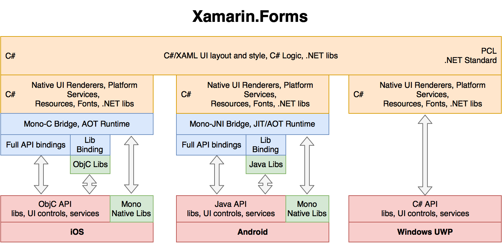

# 3. Architectures of cross-platform mobile frameworks

So far we looked at the architectures of iOS, Android and Windows UWP. As you may have noticed, all operating systems have technical abilities to run cross-platform applications. The simplest, from a technical point of view, is the use of the WebView, which is available for all OS \(actual for PhoneGap\). The second option is to use low-level mechanisms like OpenGL ES and C/C++. This will allow you to share most of the logic \(in games or Qt\) between projects, but it will be limited to work \(or not work\) on the Windows UWP. If you need a fully native user interface and native performance with minimal overhead, then the top-level API systems should be used with Xamarin and ReactNative.

To better understand the capabilities and limitations of each framework, let's look at how architecturally they are constructed and what the possibilities and limitations are.

## 3.1 PhoneGap

Solutions based on PhoneGap WebView use and are simple enough in terms of implementation - a small native app that actually only displays the built-in Web browser and single-page HTML. There are no native controls and direct access to the API - all the interface elements inside the web page are simply styled to native ones. To access the system functionality, specific plugins are connected that add JS methods inside the web browser and associate them with native implementation on each platform.

As you can see, PhoneGap allows you to share almost all of the code between platforms, but still requires the implementation of the native part on Objective C and Java \(and C\# for Windows\). The entire lifecycle of the application runs inside the WebView, so web developers feel like a fish in the water. Until there is a need for platform functionality, you will need a good understanding of iOS, Android and Windows UWP.

Also, PhoneGap \(a.k.a. Apache Cordova\) is used in the popular Ionic framework, which provides a large number of ready-to-use plug-ins for system functionality.

**NOTE: The WebView-based application interface is not native, but looks similar with the help of HTML/CSS styles**

When you develop applications using PhoneGap, experience is required in HTML, JavaScript, CSS, as well as Objective C, Java, C\# and good engineering knowledge to integrate native and cross-platform parts. The user interface is created as a single-page HTML and there will be freezing of UI in real applications with a complex interface \(it is a kind of mobile WebView issue\).

**NOTE: To transfer data over a bridge, they must be serialized/deserialized into Json**

Finally, note that PhoneGap is already a sufficiently mature solution with lots of ready-to-use plugins.

\*\*\*\*\*\*\*\*\*\*\*\*

_Therefore, PhoneGap can be recommended for fast development of simple applications \(up to 15 screens\) with a small user audience \(for example, a solution within the company\) or prototypes._

## 3.2 ReactNative

One of the interesting solutions in the field of cross-platform mobile application development is ReactNative, created within Facebook. This framework makes it possible to use JavaScript to describe native interface and application logic. The JS engine itself provides performance comparable to native. However, you should not forget that there is a bridge in the ReactNative architecture that reduces the speed of work with platform functionality and UI.

When creating applications on ReactNative, a developer will also need to implement the native part in Objective C, Java or C\#, which initializes JS engine and your JS code. Then the JS app takes control and with the help of ReactNative begins to create native objects and manage them from JavaScript. It is worth mentioning that the ReactNative architecture allows you to update the JS-code without restarting the application \(hot reloading\). This allows updating the cross-platform part without the need of republishing applications in the AppStore and Google Play. You can also use NPM libraries and a large number of third-party plugins. It’s possible to use TypeScript for ReactNative to produce well structured applications.

Keep in mind that because of the limitations of iOS \(there is no way to implement JIT\), JavaScript code is interpreted on the fly, rather than compiled. In general, this doesn't really affect performance in real-world applications, but it's worth remembering.

**NOTE: To pass complex data structures and classes between the native part and the JS engine, they must be serialized/deserialized in JSON format**

Creating applications on ReactNative requires JavaScript experience as well as good knowledge of iOS and Android. It is easy to integrate native and cross-platform parts using official documentation. The user interface is completely native, but has limitations and features when styling from JS-code, which the user will have to get used to. To transfer data over a bridge, they must be serialized/deserialized into Json. Also bridge is used to control the native objects, which may lead to reduced performance when it is not being used sufficiently \(for example, frequently changed properties of the native UI-objects from the JS-code when running animations in manual mode\).

You should also consider the current stage of the framework - there are bottlenecks or errors, which you learn only during development. And almost always it requires implementation of native part of Objective C and Java.

\*\*\*\*\*\*\*\*\*\*\*\*

_ReactNative could be recommended for rapid application development of medium complexity \(up to 40 screens\), the team must not only be experienced JS developers, but also good specialists in iOS \(ObjC/Swift\) as well as Android \(Java/Kotlin\)._

## 3.3 Qt

Qt is one of the oldest cross frameworks and is used widely in development of embedded and desktop applications. The Qt architecture allows to port it to those operating systems that have an API for C++. And iOS, and Android \(NDK\), and Windows have such a capability, although all with their own limitations.

One of the main advantages of Qt, is its own efficient user interface rendering system, either on the basis of a raster engine \(for example, CoreGraphics in iOS\) or on the basis of OpenGL \(ES\). This is what makes the framework portable. Therefore, Qt uses its own rendering of the UI, and therefore the app will look native as much as you style it.

As you can see, Qt iOS uses standard modules and UIKit CoreGraphics to render the UI. In Android, the situation is slightly more complicated, as Qt uses the NDK mechanisms to render the UI, while to access the Java API and application management is uses the already familiar JNI bridge. Also in iOS and Android, OpenGL ES can be used to render the QML or work with 3D.

In Windows there is direct access to C++ API and everything would work fine, if not for the need to use the conversion of the OpenGL ES calls to DirectX calls \(raster rendering is not satisfied with the performance and OpenGL ES is not in Windows UWP\). ANGLE library was created for that purpose.

**NOTE: The Qt-based application interface is not native, but only is made to look native with the help of styling**

In general, Qt can be recommended as a thing in itself - only ready-to-use modules of the framework plus a platform-independent library in C++. But in real projects it will be very difficult to use-a nonnative UI, there are no third-party components \(only libraries "out of the box"\), there are difficulties in assembling and debugging the application, as well as when accessing native functionality. From the pros - high performance code in C++.

\*\*\*\*\*\*\*\*\*\*\*\*

_So, Qt can be recommended for developing applications under iOS, Android and Windows UWP only if you already have a lot of experience with Qt and understanding complex system mechanisms. You should consider that in any case, the interface can only be similar to being native._

## 3.4 Xamarin

Xamarin is now available in open source and based on Mono \([http://www.mono-project.com](http://www.mono-project.com)\), an open implementation of .Net infrastructure for Unix-systems. Initially, Mono was supported by Novell and allowed running .NET applications on Linux and other open OSes.

To interact with native \(for C\) operating system interfaces in Mono, the P/Invoke \([http://www.mono-project.com/docs/advanced/pinvoke/](http://www.mono-project.com/docs/advanced/pinvoke/)\) mechanism is used. Based on Mono, the MonoTouch and MonoDroid frameworks were created, which were then renamed to Xamarin.iOS and Xamarin.Android, and now collectively referred to as the Xamarin Classic.

Classic Xamarin provides full access to the native API, therefore you can create native iOS/Android applications using C\# without a single line on Objective C and Java. Native libraries are connected through the Native Library Binding mechanism. Interaction with the OS occurs through the bridge and the wrappers mechanism, however there is no need to serialize the data, since automatic marshaling is performed and there is a possibility of direct transfer of links between the Mono Managed and Native environments. You can also use a large number of .NET libraries from NuGet.

The .NET/Mono frameworks assumes the use of JIT in analogy with Java, when the application is compiled into an intermediate bytecode and then interpreted at runtime. But because of the limitations of iOS, it is not possible to use JIT, and therefore the bytecode of Xamarin.iOS-applications is compiled into native binary and statically linked with libraries. Such a compilation is called AOT \(Ahead Of Time\) and is mandatory in Xamarin.iOS. In Xamarin.Android, in addition to AOT, JIT mode is also available, when the virtual environment of Mono works in parallel with Dalvik / ART and interprets the code at runtime.

As you can see, the common code base between the platforms is limited to business logic and data processing logic. Unfortunately, UI and platform functionality have to be implemented separately for each platform. As a result, you can not fumble more than 30% -40% of the total database of mobile application code. To achieve a better result, you need to use Xamarin.Forms, which we'll discuss in Chapter 3.5.

The key advantage of the classic Xamarin is the use of the C\# language for all code and, as a consequence, developers who are already familiar with .NET. Also a good knowledge and understanding of iOS/Android mechanisms, their class models, architectures, object lifecycles and the ability to read examples on Objective C and Java are also mandatory.

**NOTE: The performance of the C\# code is comparable to the performance of native code in iOS/Android, but when interacting with the OS, a bridge is used, which can slow down the application if it is used ineffectively**

The application for Xamarin.iOS/Xamarin.Android usually consists of a shared part that is packaged into a .NET library and a platform part that has full access to the API, including the native user interface. The platform part describes the screens, resources, styles, fonts - almost 100% structure of the native project on Objective C or Java, only in C\#. Also there is the possibility of code in C\# in native projects using Embeddinator-4000 \([https://mono.github.io/Embeddinator-4000](https://mono.github.io/Embeddinator-4000/)\).

Classic Xamarin is a mature enough solution and provides the closest to native development experience for C\# programmers and using familiar tools like Visual Studio.

\*\*\*\*\*\*\*\*\*\*\*\*

_So, if the task is to implement a fully native application and there are experienced C \# developers, Xamarin can be a good choice for a wide range of tasks, both large \(more than 40\) and small \(up to 10\)._

## 3.5 Xamarin.Forms {#p35}

If you have a goal to maximize the overall code base, then the classic Xamarin here obviously loses to all the other frameworks \(PhoneGap, ReactNative, Qt and their counterparts\). This was understood in Xamarin itself, so they released a solution that allows using a single description of UI and simple mechanisms of access to platform features - Xamarin.Forms.

The Xamarin.Forms library works on top of the previously described classic Xamarin and in fact provides mechanisms for virtualizing the user interface and additional infrastructure.

Xamarin.Forms \(XF\) solves a sort of "last mile" task by providing a single API for working with the user interface in different operating systems \(iOS, Android, Windows UWP/WPF, Linux Gtk\#, Mac OS X, Tizen\). At the same time, the interface itself remains completely native.

In order to better understand how XF works, let\'s look at a simple button. One of the basic mechanisms is renderers, thanks to which when the Xamarin.Forms button is displayed, native control is actually added to the screen, and the XF-button properties are dynamically translates into the properties of the native button on each platform. ReactNative uses similar mechanisms.

The shared part on Xamarin.Forms is usually implemented as a library \(Portable/PCL or .NET Standard\) and has access to the component database in NuGet. The platform part is implemented on the basis of Xamarin Classic and has full access to the API, as well as the ability to connect third-party libraries. At the same time, the total percentage of code between platforms usually reaches 85%. Also Xamarin.Forms can be used in Embedded mode to create separate screens and View inside applications on the classic Xamarin.iOS and Xamarin.Android.

If you have enough components and plug-ins already available in Xamarin.Forms, then you do not need deep knowledge in iOS/Android/Windows. However, for more complex scenarios \(its control, full implementation of the design in pixel perfect mode\), you still need a good knowledge of the OS and its mechanisms, plus an understanding of Xamarin.Forms.

Despite the fact that the classic Xamarin is a mature and stable solution, Xamarin.Forms is still a young enough and actively developing superstructure over it, so problems and bottlenecks with which one should be attentive can appear.

\*\*\*\*\*\*\*\*\*\*\*\*

_So, Xamarin.Forms can be recommended for rapid development of prototypes in C\#, however Xamarin.Forms can also be used for corporate and business applications of any scale. Appearance, performance and application behavior will be completely native, but you should not forget about effective interaction with the operating system across the bridge._

